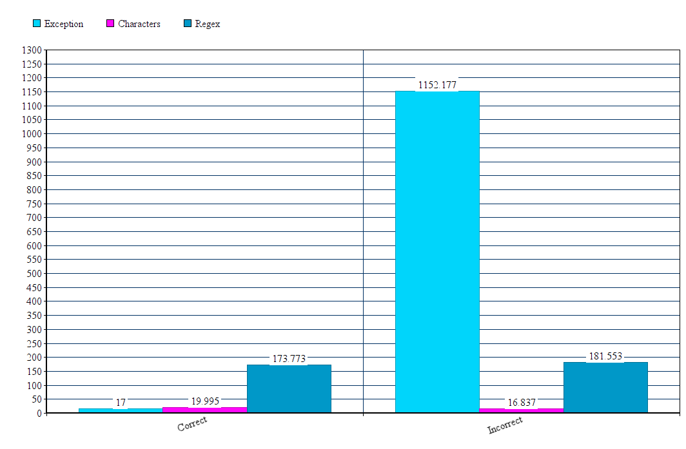

## Запустить тесты можно с помощью : `gradle jmh`

##Параметры и окружения в котором проводилось тестирование:
```# JMH version: 1.28
# VM version: JDK 11.0.10, Dynamic Code Evolution 64-Bit Server VM, 11.0.10+9-b1341.41
# VM invoker: ~/.local/share/JetBrains/Toolbox/apps/IDEA-U/ch-0/211.7142.45/jbr/bin/java
# VM options: -Dfile.encoding=UTF-8 -Djava.io.tmpdir=/home/edubinskaya/Documents/git/NSUJavaOptimization/Task 8-2/build/tmp/jmh -Duser.country=US -Duser.language=en -Duser.variant
# Blackhole mode: full + dont-inline hint
# Warmup: 5 iterations, 10 s each
# Measurement: 3 iterations, 10 s each
# Timeout: 10 min per iteration
# Threads: 1 thread, will synchronize iterations
```

##Результаты тестирования в таблице:
```
Benchmark             (test_string)  Mode  Cnt     Score    Error  Units
Tests.testCharacters       13472956  avgt   15    19.995 ±  1.647  ns/op
Tests.testCharacters       134729zz  avgt   15    16.837 ±  1.709  ns/op
Tests.testException        13472956  avgt   15    17.068 ±  2.154  ns/op
Tests.testException        134729zz  avgt   15  1152.177 ± 78.103  ns/op
Tests.testRegex            13472956  avgt   15   173.773 ± 14.479  ns/op
Tests.testRegex            134729zz  avgt   15   181.553 ± 13.213  ns/op
```

##Результаты тестирования на гистограме:
<p align="center">
  
</p>